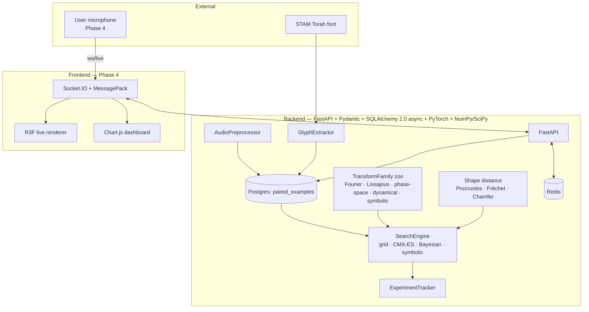
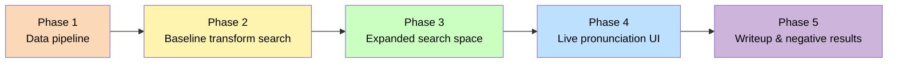

# audio-glyph-inference

A research-grade experimental system that tries to **infer a mathematically explicit transformation `F_θ` from the spoken sound of a Hebrew letter to its written glyph shape** — not the letter label, not a decorative rendering. The unknown is the algorithm itself.

```text
F_θ : x(t) → G       where  x(t) is spoken audio
                             G     is 2D glyph geometry
                             θ     is a constrained, interpretable parameter vector
```

Given paired examples `(x_i, L_i)` of (audio sample, target Hebrew-letter contour), we search for the simplest `F_θ` that minimizes `Σ d(F_θ(x_i), L_i)` and generalizes across letters and speakers. Negative results are an acceptable outcome.

> **What this project is NOT.** Not a classifier (phoneme → label). Not a generative model (latent → pixels). Not a decorative visualization pipeline. Not a black-box neural net dressed as math. See `docs/AUDIO_GLYPH_INFERENCE_MASTER_PLAN.md` §0 for the full problem statement.

---

## High-level architecture



## Phase roadmap



See `docs/AUDIO_GLYPH_INFERENCE_MASTER_PLAN.md` for the full per-phase breakdown, Mermaid gantt, and gate checklists. See `docs/phases/phase-{N}-plan.md` for per-phase task lists.

## Running it

```bash
./run_audio_glyph_inference.sh        # macOS / Linux
run_audio_glyph_inference.bat         # Windows
```

The launcher builds the Docker stack (Postgres 16 + Redis 7 + backend), polls `/health` until ready, and drops into a `[k] [q] [v] [r]` shutdown/restart loop. See `docs/run_guide.md` for details.

Once up:
- Backend: <http://localhost:8000>
- API docs: <http://localhost:8000/docs>
- OpenAPI JSON: <http://localhost:8000/openapi.json>

## Stack at a glance

| Layer              | Choice                                                                                                                            |
|--------------------|-----------------------------------------------------------------------------------------------------------------------------------|
| Language (backend) | Python 3.11+, `from __future__ import annotations`                                                                                |
| API                | FastAPI + `uvicorn[standard]`                                                                                                     |
| Schemas            | Pydantic v2, Pydantic Settings                                                                                                    |
| Database           | PostgreSQL 16 via SQLAlchemy 2.0 async + `asyncpg`, Alembic migrations                                                            |
| Cache / pubsub     | Redis 7                                                                                                                           |
| Numerics           | NumPy · SciPy · pandas · Numba · PyTorch · torchaudio                                                                             |
| Audio              | librosa · soundfile · pyloudnorm                                                                                                  |
| Glyph / contour    | freetype-py · opencv-python-headless · shapely · Pillow                                                                           |
| Static viz         | matplotlib + seaborn (analysis notebooks only)                                                                                    |
| Tracking           | JSONL + Pydantic (lightweight, mirrored to MLflow only if needed)                                                                 |
| Test               | pytest + pytest-asyncio + pytest-cov (100% coverage gate)                                                                         |
| Lint / format      | ruff                                                                                                                              |
| Package manager    | uv                                                                                                                                |
| Container          | Docker + docker-compose with healthchecks and `depends_on: service_healthy`                                                       |
| CI/CD              | GitLab CI — lint → test → coverage gate → build → docker-build → manual release                                                  |
| Frontend (Phase 4) | React 18 · TypeScript strict · Vite · Zustand · @react-three/fiber + drei · Chart.js · socket.io-client                           |

Full dependency rationale (and every version decision) lives in `docs/dependencies.md`.

## Repository tour

```text
audio-glyph-inference/
├── CLAUDE.md                              Operational schema for every session (mandatory re-read)
├── README.md                              (you are here)
├── docker-compose.yml                     Postgres + Redis + backend, with healthchecks
├── run_audio_glyph_inference.{sh,bat}     Launcher with [k]/[q]/[v]/[r] loop
├── .env                                   Port and credential defaults (override locally)
├── .gitignore
├── .gitlab-ci.yml                         CI/CD pipeline (GitLab)
├── .claude/
│   ├── settings.json                      Hooks, permissions
│   ├── commands/                          /scaffold, /review, /pre-commit, /validate, /phase-status, /new-transform-family
│   └── skills/                            phase-awareness, transform-protocol, data-driven-check, validation-protocol, frontend-protocol
├── docs/
│   ├── AUDIO_GLYPH_INFERENCE_MASTER_PLAN.md    Authoritative goals, contracts, phase gates, Mermaid diagrams
│   ├── status.md                          What was just built / what's next
│   ├── versions.md                        Semver-ordered changelog
│   ├── run_guide.md                       Local run instructions
│   ├── dependencies.md                    Why each package was picked
│   └── phases/phase-{1..5}-plan.md        Per-phase task breakdowns
└── backend/
    ├── Dockerfile                         Python 3.11-slim, uv, multi-service-ready
    ├── .dockerignore
    ├── pyproject.toml                     All deps, ruff config, pytest config, 100% coverage gate
    ├── data/
    │   ├── fonts/                         StamAshkenazCLM.ttf (Culmus, GPL v2, committed)
    │   ├── audio/                         Raw audio samples (not committed)
    │   └── contours/                      Extracted glyph contours as .npy
    ├── experiments/                       Experiment tracker output (JSONL)
    ├── src/
    │   ├── constants.py                   Hebrew letters + universal constants
    │   ├── config.py                      BackendSettings (Pydantic Settings)
    │   ├── api/
    │   │   ├── main.py                    FastAPI app factory
    │   │   └── routers/                   health · datasets · experiments · inference · live (P4)
    │   ├── models/                        Pydantic domain models (one per file)
    │   ├── simulation/
    │   │   ├── audio_preprocessor.py
    │   │   ├── glyph_extractor.py
    │   │   ├── shape_distance.py
    │   │   ├── search_engine.py
    │   │   ├── experiment_tracker.py
    │   │   └── transforms/
    │   │       ├── transform_base.py       TransformFamily protocol
    │   │       ├── fourier_series.py       Phase 2
    │   │       ├── lissajous.py            Phase 2
    │   │       ├── phase_space_embedding.py Phase 2
    │   │       ├── dynamical_system.py     Phase 3
    │   │       └── symbolic_regression.py  Phase 3
    │   └── data/
    │       ├── database.py                 Async engine / session factory
    │       └── orm/                        SQLAlchemy rows (one per file, mirror src/models/)
    └── tests/                              Mirror src/ structure; 100% coverage gate in CI
```

## Current state

See `docs/status.md`. At the time of this scaffold the project is **Phase 1, scaffold-only**: every simulation method raises `NotImplementedError` and there is no logic yet. The next action is to decide the audio data source (see master plan §11.1) and place a STAM Torah font in `backend/data/fonts/`.