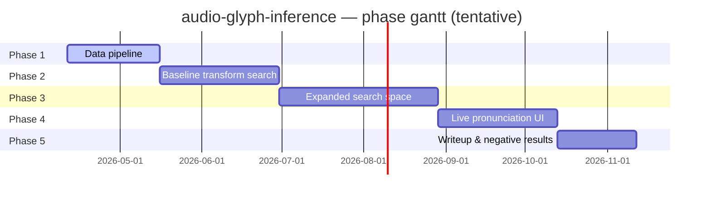

# Audio-Glyph Inference — Master Plan

> **Authoritative source for project goals, phases, architecture, and gate criteria.**
> If a request conflicts with this document, stop and flag it before implementing.

---

## 0. The One-Sentence Brief

> Infer a compact, interpretable, mathematically explicit transformation `F_θ` that maps the spoken sound of a Hebrew letter to its written glyph shape, using paired training examples to recover the transformation itself — not the letter label, not a decorative rendering.

## 1. Motivation

Conventional ML treats the spoken-letter-to-written-letter pairing as a *classification* problem (phoneme → label) or a *generation* problem (latent → pixels). Both discard the structural question: is there a compact mathematical operator that takes the audio waveform and produces the glyph geometry, directly?

The unknown object is the **algorithm itself**. The input distribution is given (recordings of Hebrew letters). The output distribution is given (glyph contours rendered from a STAM-style Torah font). The research question is:

> What family of functions `F_θ: x(t) → G` minimizes the shape distance `d(F_θ(x_i), L_i)` across training pairs, under constraints of simplicity, interpretability, and generalization across speakers?

This is **system identification / operator inference** — not classification, not generative modeling, not supervised glyph regression.

## 2. Problem Statement

Let `x_i(t)` be the i-th recorded audio sample and `L_i ∈ ℝ^(N×2)` be the canonical target glyph contour for the letter spoken in `x_i`. We seek a transformation family `F_θ` and parameter vector `θ*` solving:

$$
\theta^* = \arg\min_\theta \; \sum_i d\bigl(F_\theta(x_i),\; L_i\bigr)\; + \;\lambda \cdot \mathrm{Complexity}(F_\theta)
$$

Subject to:

- **Generalization across speakers.** θ* must produce low d on held-out recordings by held-out speakers.
- **Shared-across-letters preference.** A single θ* that works for all 22 letters beats 22 letter-specific θ*'s — we explicitly penalize per-letter tuning.
- **Interpretability.** F must be an explicit mathematical operator — Fourier series, Lissajous curve, phase-space embedding, ODE solution, symbolic-regression expression — not a black-box neural net used directly.
- **Simplicity.** Subject to accuracy, shorter descriptions (in the MDL sense) dominate longer ones.

**Negative results are a valid outcome.** If the search space contains no family that generalizes, we report that finding with the search transcript.

## 3. Data Contracts (sacred — see project `CLAUDE.md` §3)

### 3.1 Hebrew letter label space

The 22 standard letters of the alef-bet, in canonical order:

```
א ב ג ד ה ו ז ח ט י כ ל מ נ ס ע פ צ ק ר ש ת
```

Sofit (final) forms share the phoneme of their base letter — they are visual variants handled at the glyph extraction layer, not the audio layer. Niqqud (vowel markings) are out of scope for Phases 1–5.

### 3.2 AudioSample

One raw recording of a single letter being spoken.

| Field              | Type     | Meaning                                                                       |
|--------------------|----------|-------------------------------------------------------------------------------|
| `id`               | UUID     | Primary key                                                                   |
| `letter`           | str      | One of the 22 letters above                                                   |
| `speaker_id`       | str      | Opaque speaker identifier. In Phase 1 all samples come from the project owner |
| `accent`           | str      | One of `constants.ACCENTS`: `ashkenazi` / `sephardi` / `moroccan` / `yemenite` / `chabad` |
| `source`           | str      | Origin tag; `'user'` is the Phase 1 default                                   |
| `file_path`        | str      | Absolute path inside the container                                            |
| `sample_rate_hz`   | int      | Native sample rate of the file                                                |
| `duration_s`       | float    | Duration in seconds                                                           |
| `recorded_at`      | datetime | Recording or ingestion timestamp                                              |

### 3.3 GlyphTarget

The canonical 2D target shape for one letter, rendered from a STAM-style Torah font.

| Field             | Type  | Meaning                                                         |
|-------------------|-------|-----------------------------------------------------------------|
| `id`              | UUID  | Primary key                                                     |
| `letter`          | str   | One of the 22 letters                                           |
| `font_name`       | str   | Font file name, tracked for reproducibility                     |
| `raster_size_px`  | int   | Square raster used during rendering                             |
| `contour_path`    | str   | Path to `.npy` file holding (N, 2) float64 contour              |
| `num_points`      | int   | Number of resampled contour points                              |

**Units:** contour coordinates are in the unit square `[-0.5, 0.5]` with origin at centroid. Never raw pixels.

### 3.4 PairedExample

Atomic training unit — one audio sample bound to one target glyph.

| Field              | Type | Meaning                                      |
|--------------------|------|----------------------------------------------|
| `id`               | UUID | Primary key                                  |
| `audio_sample_id`  | UUID | FK → AudioSample                             |
| `glyph_target_id`  | UUID | FK → GlyphTarget                             |
| `letter`           | str  | Denormalized for query convenience           |
| `split`            | str  | `train` / `val` / `test`, assigned per speaker |

### 3.5 TransformCandidate

A frozen `F_θ` produced by a search run.

| Field                    | Type               | Meaning                                                         |
|--------------------------|--------------------|-----------------------------------------------------------------|
| `id`                     | UUID               | Primary key                                                     |
| `family`                 | str                | Registered family name (`fourier_series`, `lissajous`, ...)     |
| `theta`                  | dict[str, float]   | Fitted parameter vector                                         |
| `shared_across_letters`  | bool               | Whether θ is shared (True) or letter-specific (False)           |
| `interpretability_score` | float              | [0,1] — penalizes parameter count and opacity                   |
| `simplicity_score`       | float              | [0,1] — typically 1 / (1 + MDL)                                 |
| `mean_shape_distance`    | float              | Average Procrustes / Fréchet distance on evaluation split       |
| `created_at`             | datetime           | Timestamp                                                       |

### 3.6 ExperimentRun

One configured search.

| Field              | Type      | Meaning                                                     |
|--------------------|-----------|-------------------------------------------------------------|
| `id`               | UUID      | Primary key                                                 |
| `name`             | str       | Human-readable label                                        |
| `family`           | str       | Transform family under search                               |
| `search_strategy`  | str       | `grid` / `cma-es` / `bayesian` / `symbolic-regression`       |
| `dataset_split`    | str       | e.g. `train`, `train+val`                                   |
| `scoring_metric`   | str       | `procrustes` / `frechet` / `chamfer`                        |
| `max_evaluations`  | int       | Compute budget                                              |
| `started_at`       | datetime  | ISO                                                         |
| `completed_at`     | datetime  | Nullable                                                    |
| `best_candidate_id`| UUID      | Nullable                                                    |

**Contract rule.** These shapes cross every layer: Pydantic models (`backend/src/models/`), SQLAlchemy ORM rows (`backend/src/data/orm/`), future API responses, and the future frontend's TypeScript interfaces. Changing any field is a **major semver bump** — ask the user first.

## 4. Transform Search Space

Each family is a separate module under `backend/src/simulation/transforms/`. All families implement the `TransformFamily` protocol: `name`, `parameter_space`, `forward`. Output is `ndarray (N, 2) float64` in the unit square.

| Family                  | Phase | Parameter count (typical) | Idea                                                                                                   |
|-------------------------|-------|---------------------------|--------------------------------------------------------------------------------------------------------|
| `fourier_series`        | 2     | ~8–16                     | Low-order Fourier closed contour; θ are {a_k, b_k, phi_k, psi_k, K}                                    |
| `lissajous`             | 2     | ~4–6                      | Two coupled oscillators; θ are {freq_ratio, phase_offset, amp_x, amp_y}                                |
| `phase_space_embedding` | 2     | ~4                        | Takens delay embedding; θ are {τ, gain, rotation, center}                                              |
| `dynamical_system`      | 3     | ~6–12                     | Van der Pol / Duffing / coupled resonators driven by audio                                             |
| `symbolic_regression`   | 3     | varies                    | PySR-proposed closed-form expression from audio spectral features → Fourier coefficients              |

## 5. Scoring

Shape distance metrics all take two `(N, 2) float64` arrays and return a float, in the unit square.

| Metric                 | Properties                                                    | Use                                                     |
|------------------------|---------------------------------------------------------------|---------------------------------------------------------|
| `procrustes_distance`  | Full-Procrustes after optimal similarity alignment            | Default fitness; rotation/scale/translation invariant   |
| `frechet_distance`     | Discrete Fréchet                                              | Order-sensitive check (preserves stroke direction)      |
| `chamfer_distance`     | Symmetric Chamfer                                             | Robust to sampling irregularities                       |

The **Complexity(F_θ)** regularizer in §2 is computed from θ's cardinality and the family's declared simplicity score (MDL-like).

## 6. Phase Roadmap



See `docs/phases/phase-{N}-plan.md` for per-phase task breakdowns and acceptance criteria.

### Phase 1 — Data pipeline
**Goal.** End-to-end ingestion of audio + glyphs into a queryable paired-example store.
**Scope.** Audio ingestion (upload + optional public-dataset ingester), preprocessing (resample → normalize → frame), glyph rendering from STAM font, contour extraction, Postgres persistence, minimal FastAPI (`/health`, `/api/datasets/*`).
**Exit gate.** See §9.
**Out of scope.** Any transform search, any UI, any WebSocket, any symbolic regression.

### Phase 2 — Baseline transform search
**Goal.** A working `SearchEngine` that fits three baseline `TransformFamily` instances to the dataset and ranks candidates.
**Scope.** `TransformFamily` protocol, Fourier / Lissajous / phase-space families, `SearchEngine` with grid + CMA-ES, shape-distance metrics, experiment tracker (JSONL + Pydantic). Inference endpoint for one-shot evaluation.
**Exit gate.** At least one candidate scores below a baseline shape-distance threshold on ≥50% of letters across ≥2 speakers.
**Out of scope.** PySR, dynamical systems, UI.

### Phase 3 — Expanded search space
**Goal.** Expand the family zoo and measure generalization rigorously.
**Scope.** Dynamical-system family (Van der Pol, Duffing, coupled resonators), symbolic regression via PySR (optional dep), cross-speaker generalization eval harness, negative-results reporting scaffolding.
**Exit gate.** Either (a) a shared-across-letters candidate beats the Phase 2 baseline with statistical significance on held-out speakers, OR (b) the search transcript supports a documented negative-results writeup.
**Out of scope.** UI, production deployment.

### Phase 4 — Live pronunciation UI
**Goal.** Interactive tool: speak a letter, see the generated geometry, the target glyph, the shape-distance score.
**Scope.** Scaffold `frontend/` (React 18 + TS strict + Vite + Zustand + R3F + Chart.js + Socket.IO). WebSocket `/ws/live` with MessagePack binary frames. Real-time audio capture → stream → inference → R3F render.
**Exit gate.** A user can pronounce each of the 22 letters into the browser and see the inferred geometry + score update at ≥10 Hz.
**Out of scope.** User accounts, persistence of user recordings.

### Phase 5 — Writeup & negative results
**Goal.** Paper-grade analysis of what was found (and not found).
**Scope.** Analysis notebooks, per-family leaderboards, cross-speaker generalization tables, negative-result discussion, methodological reflection.
**Out of scope.** Any production code change.

## 7. Architecture

```mermaid
graph TD
    subgraph "External / data sources"
        USER[User microphone<br/>Phase 4]
        FORVO[Public-dataset ingest<br/>Phase 1: TBD]
        FONT[STAM Torah font<br/>backend/data/fonts/]
    end

    subgraph "Backend (Python 3.11+)"
        PREP[simulation/audio_preprocessor.py]
        GLYPH[simulation/glyph_extractor.py]
        PAIRS[(Postgres<br/>paired_examples)]
        TRANSFORMS[simulation/transforms/*<br/>Fourier / Lissajous / ...]
        SEARCH[simulation/search_engine.py]
        TRACK[simulation/experiment_tracker.py]
        EXP[(Postgres<br/>experiment_runs +<br/>transform_candidates)]
        SCORE[simulation/shape_distance.py]
        API[FastAPI<br/>src/api/main.py]
        REDIS[(Redis<br/>cache / pubsub)]
    end

    subgraph "Frontend (React 18 + TS strict, Phase 4)"
        LIVE[LiveRenderer.tsx<br/>@react-three/fiber]
        DASH[Chart.js dashboard]
        WS[Socket.IO + MessagePack]
    end

    USER -->|WebSocket| WS
    FORVO --> PREP
    FONT --> GLYPH
    PREP --> PAIRS
    GLYPH --> PAIRS
    PAIRS --> SEARCH
    TRANSFORMS --> SEARCH
    SCORE --> SEARCH
    SEARCH --> EXP
    SEARCH --> TRACK
    API --> PAIRS
    API --> EXP
    API <-->|Redis pubsub| REDIS
    WS -->|audio frames| API
    API -->|generated geometry| WS
    WS --> LIVE
    WS --> DASH
```

## 8. Module Dependency Graph (backend)

```mermaid
graph LR
    constants[src/constants.py]
    config[src/config.py]
    models[src/models/*]
    orm[src/data/orm/*]
    db[src/data/database.py]
    prep[src/simulation/audio_preprocessor.py]
    glyph[src/simulation/glyph_extractor.py]
    dist[src/simulation/shape_distance.py]
    tbase[src/simulation/transforms/transform_base.py]
    tfam[src/simulation/transforms/{fourier,lissajous,...}]
    search[src/simulation/search_engine.py]
    track[src/simulation/experiment_tracker.py]
    api[src/api/main.py]
    routers[src/api/routers/*]

    config --> prep
    config --> glyph
    constants --> models
    constants --> glyph
    models --> orm
    orm --> db
    tbase --> tfam
    tfam --> search
    prep --> search
    dist --> search
    search --> track
    models --> routers
    db --> routers
    prep --> routers
    glyph --> routers
    routers --> api
```

## 9. Definition-of-Done Gates

### Phase 1
- [ ] `docker compose up --build -d` succeeds and `curl localhost:8000/health` returns 200
- [ ] `POST /api/datasets/audio` accepts a WAV file and stores an `AudioSample` row
- [ ] `POST /api/datasets/glyphs` renders a letter from the STAM font and stores a `GlyphTarget` row + `.npy` contour
- [ ] `POST /api/datasets/pairs` associates rows into a `PairedExample`
- [ ] `GET /api/datasets/pairs` lists paired examples with `split` assignments
- [ ] `AudioPreprocessor` produces `(num_frames, frame_length) float64` output matching `config.audio_sample_rate_hz`
- [ ] `GlyphExtractor` produces `(num_contour_points, 2) float64` contours in unit square for every letter
- [ ] Pytest: 100% line coverage across `backend/src/`, matching test file for every module
- [ ] Ruff clean (`ruff check .` + `ruff format --check .`)
- [ ] GitLab CI pipeline green (lint → test → coverage gate → build → docker-build)
- [ ] `docs/status.md` and `docs/versions.md` current

### Phase 2
- [ ] `TransformFamily` protocol and three baseline families implemented end-to-end
- [ ] `SearchEngine` fits and ranks candidates with both grid and CMA-ES strategies
- [ ] All shape-distance metrics implemented with reference-value tests
- [ ] `POST /api/experiments` and `GET /api/experiments/{id}` functional
- [ ] `POST /api/inference` evaluates one audio sample against a candidate
- [ ] At least one candidate achieves documented baseline shape-distance threshold

### Phase 3
- [ ] Dynamical-system family implemented with reference-case validation
- [ ] Symbolic-regression family behind optional `[symbolic]` extra
- [ ] Cross-speaker eval harness + report
- [ ] Either a generalizing candidate OR a documented negative-results section in `docs/negative-results.md`

### Phase 4
- [ ] `frontend/` scaffolded (React 18 + TS strict + Vite + Zustand + R3F + Chart.js + Socket.IO)
- [ ] WebSocket `/ws/live` with MessagePack binary protocol, bidirectional
- [ ] Live-pronunciation view renders generated geometry at ≥10 Hz
- [ ] Chart.js score dashboard shows per-letter shape distance and history
- [ ] Vitest 100% coverage on `src/utils/` frontend logic

### Phase 5
- [ ] Writeup in `docs/writeup.md` (or equivalent)
- [ ] Per-family leaderboards
- [ ] Cross-speaker generalization tables
- [ ] Reproducible experiment manifest

## 10. Cross-Phase Concerns

- **Canonical unit system.** Audio: sample rate in Hz, frame length in samples, amplitude in `[-1, 1]`. Glyph: unit-square coordinates in `[-0.5, 0.5]`. Conversions live at module boundaries, never mid-calculation.
- **Reproducibility.** Every `ExperimentRun` records the font name, the full `config.BackendSettings`, the search strategy, and the RNG seed. Never invent or guess numbers.
- **Data sources.** P1 must include a clear decision on audio sources — user-recorded vs a public dataset (candidates: Common Voice he, Forvo, scraped Torah-reading clips, synthetic TTS as a fallback baseline). This is an open question flagged for resolution in P1 gate planning.
- **No drive-by changes.** Do not modify the contracts in §3 without an explicit architectural decision recorded here.
- **Forbidden shortcuts** (carried from the user's original brief):
  - No hand-drawn shaping
  - No manually nudging outputs to resemble letters
  - No purely decorative visualization pipeline
  - No black-box pattern matcher as the main solution — acceptable only as a candidate-proposer that feeds symbolic-regression conversion

## 11. Open Questions

Resolved during initial scaffolding (2026-04-11):

### 11.1 Audio dataset source — RESOLVED

**Decision.** User-recorded `.m4a` uploads only. The project owner is the sole speaker in Phases 1–5. No public-dataset ingestion is in scope.

**Why.** A single consistent speaker removes inter-speaker timbre/formant variance from the experimental signal, leaving the **accent** as the primary controllable variable. This makes the cross-accent generalization test (§11.3) the cleanest research question available at this scale. `.m4a` is what the user's recording device produces natively; decoding happens server-side via `librosa` + `audioread` (ffmpeg backend) — no client-side transcode needed.

**How to apply.**
- Every `AudioSample.source` is `'user'` in Phase 1.
- Every `AudioSample.speaker_id` is the project owner's opaque ID (stable across sessions).
- Every `AudioSample.accent` is one of `constants.ACCENTS` (`ashkenazi`, `sephardi`, `moroccan`, `yemenite`, `chabad`).
- The Phase 1 ingestion UX is a single `POST /api/datasets/audio` endpoint that accepts a multipart `.m4a` upload plus form fields `letter`, `accent`, and `repetition`. The backend decodes, normalizes, and writes a canonical WAV alongside the original m4a under `backend/data/audio/{accent}/{letter}/`. The recording conventions, validation rules, and server flow are fully specified in `docs/recording_protocol.md` — the router and preprocessor implement that doc.
- The data collection task is: record ≥N repetitions of each of the 22 letters in each of the 5 accents (where N is locked during P1 — initial target: 5 per letter per accent = **550 total samples**).
- Do NOT build a public-dataset ingester. Out of scope.
- Do NOT build a CLI recorder or a browser recording page. The user uploads pre-recorded m4a files.

### 11.2 Glyph font choice — RESOLVED

**Decision.** `StamAshkenazCLM.ttf` from the [Culmus Project](https://culmus.sourceforge.io/) (upstream author Yoram Gnat, packaged in the CLM set by Maxim Iorsh). License: **GNU GPL v2** with a font exception — redistribution is permitted. The font file, its LICENSE, and its README are committed under `backend/data/fonts/`.

**Why.** Stam Ashkenaz is the canonical STAM Torah-scribal script; the CLM variant is free, widely used, small (~15 KB), and renders cleanly via freetype-py without external dependencies. The license permits inclusion in this project.

**How to apply.**
- `config.BackendSettings.font_file` defaults to `/app/data/fonts/StamAshkenazCLM.ttf`.
- If a letter proves too stroke-thick for stable contour extraction, consider a thinner Culmus variant (same project), but do not introduce a second font without updating this section.
- Keep the LICENSE file co-located with the font for GPL compliance.

### 11.3 Generalization-split policy — RESOLVED

**Decision.** **Accent-disjoint splits**, not speaker-disjoint.

**Why.** With a single speaker, speaker-disjoint splits are undefined. The primary generalization test for the project is: *does a transform fitted on four accents produce the correct glyph geometry for the fifth?* That is a stronger research claim than cross-speaker generalization would be, because the accents meaningfully change phoneme realization while the speaker stays constant.

**How to apply.**
- `PairedExample.split` is assigned by accent. For each experiment, one accent is held out as `test`, and the remaining four are split into `train`/`val` at the per-letter level.
- The standard evaluation reports per-accent shape-distance means and a **leave-one-accent-out** table (5 rows — one per accent held out).
- A candidate that only works on the accent it was fitted to is an overfit, not a discovery. Report accordingly.

### 11.4 Scoring metric default — RESOLVED

**Decision.** `procrustes_distance` is the default fitness. `frechet_distance` is the stroke-order tiebreaker. `chamfer_distance` is the sampling-robustness tiebreaker.