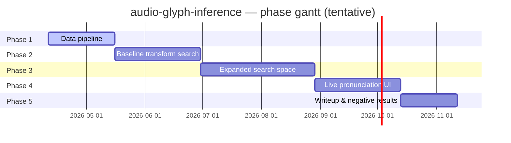

# Audio-Glyph Inference — Master Plan

> **Authoritative source for project goals, phases, architecture, and gate criteria.**
> If a request conflicts with this document, stop and flag it before implementing.

---

## 0. The One-Sentence Brief

> Infer a compact, interpretable, mathematically explicit transformation `F_θ` that maps the spoken sound of a Hebrew letter to its written glyph shape, using paired training examples to recover the transformation itself — not the letter label, not a decorative rendering.

## 1. Motivation

Conventional ML treats the spoken-letter-to-written-letter pairing as a *classification* problem (phoneme → label) or a *generation* problem (latent → pixels). Both discard the structural question: is there a compact mathematical operator that takes the audio waveform and produces the glyph geometry, directly?

The unknown object is the **algorithm itself**. The input distribution is given (recordings of Hebrew letters). The output distribution is given (glyph contours rendered from a STAM-style Torah font). The research question is:

> What family of functions `F_θ: x(t) → G` minimizes the shape distance `d(F_θ(x_i), L_i)` across training pairs, under constraints of simplicity, interpretability, and generalization across accents (a single speaker; see §11.3)?

This is **system identification / operator inference** — not classification, not generative modeling, not supervised glyph regression.

## 2. Problem Statement

Let `x_i(t)` be the i-th recorded audio sample and `L_i ∈ ℝ^(N×2)` be the canonical target glyph contour for the letter spoken in `x_i`. We seek a transformation family `F_θ` and parameter vector `θ*` solving:

$$
\theta^* = \arg\min_\theta \; \sum_i d\bigl(F_\theta(x_i),\; L_i\bigr)\; + \;\lambda \cdot \mathrm{Complexity}(F_\theta)
$$

Subject to:

- **Generalization across accents.** θ* must produce low d on recordings in a held-out accent (single speaker, leave-one-accent-out; see §11.3).
- **Shared-across-letters preference.** A single θ* that works for all 22 letters beats 22 letter-specific θ*'s — we explicitly penalize per-letter tuning.
- **Interpretability.** F must be an explicit mathematical operator — Fourier series, Lissajous curve, phase-space embedding, ODE solution, symbolic-regression expression — not a black-box neural net used directly.
- **Simplicity.** Subject to accuracy, shorter descriptions (in the MDL sense) dominate longer ones.

**Negative results are a valid outcome.** If the search space contains no family that generalizes, we report that finding with the search transcript.

## 3. Data Contracts (sacred — see project `CLAUDE.md` §3)

### 3.1 Hebrew letter, audio-form, and glyph-form spaces

The 22 standard base letters of the alef-bet, in canonical order:

```
א ב ג ד ה ו ז ח ט י כ ל מ נ ס ע פ צ ק ר ש ת
```

These remain exposed as `constants.HEBREW_LETTERS` and are the base-letter axis used by search/evaluation.

The written glyph-form space is `constants.GLYPH_FORMS`: the 22 regular forms plus the five sofit forms `ך ם ן ף ץ`. Sofit forms map back to their base letters through `constants.BASE_LETTER_BY_GLYPH_FORM`; they are glyph targets, not separate audio labels.

The spoken audio-form space is `constants.AUDIO_FORM_KEYS`: every non-begadkefat base letter has `pronunciation_variant="plain"`, and the six traditional begadkefat letters `ב ג ד כ פ ת` have explicit `hard` and `soft` variants. Niqqud (vowel markings) are out of scope for Phases 1-5.

### 3.2 AudioSample

One raw recording of a single base-letter pronunciation variant being spoken.

| Field              | Type     | Meaning                                                                       |
|--------------------|----------|-------------------------------------------------------------------------------|
| `id`               | UUID     | Primary key                                                                   |
| `letter`           | str      | Base letter; one of `constants.HEBREW_LETTERS`                                |
| `speaker_id`       | str      | Opaque speaker identifier. In Phase 1 all samples come from the project owner |
| `accent`           | str      | One of `constants.ACCENTS`: `ashkenazi` / `sephardi` / `moroccan` / `yemenite` / `chabad` |
| `repetition`       | int      | 1-based repetition index within a `(speaker_id, accent, letter, pronunciation_variant)` recording block |
| `pronunciation_variant` | str | One of `plain` / `hard` / `soft`; constrained by `constants.PRONUNCIATION_VARIANTS_BY_BASE_LETTER` |
| `source`           | str      | Origin tag; `'user'` is the Phase 1 default                                   |
| `file_path`        | str      | Absolute path inside the container                                            |
| `sample_rate_hz`   | int      | Native sample rate of the file                                                |
| `duration_s`       | float    | Duration in seconds                                                           |
| `recorded_at`      | datetime | Recording or ingestion timestamp                                              |

**Uniqueness.** `(speaker_id, accent, letter, pronunciation_variant, repetition)` is unique — second-precision timestamps cannot disambiguate repetitions; the ORM row enforces it.

### 3.3 GlyphTarget

The canonical 2D target shape for one written glyph form, rendered from a STAM-style Torah font.

| Field             | Type  | Meaning                                                         |
|-------------------|-------|-----------------------------------------------------------------|
| `id`              | UUID  | Primary key                                                     |
| `letter`          | str   | Base letter; one of `constants.HEBREW_LETTERS`                  |
| `glyph_form`      | str   | Written form; one of `constants.GLYPH_FORMS`                    |
| `font_name`       | str   | Font file name, tracked for reproducibility                     |
| `raster_size_px`  | int   | Square raster used during rendering                             |
| `contour_path`    | str   | Path to `.npz` holding the ordered (n_i, 2) float64 stroke contours |
| `num_points`      | int   | Total resampled contour points across all strokes              |
| `num_contours`    | int   | Number of ordered stroke contours (1 for most; 2 for ה / ק)    |

**Units:** contour coordinates are in the unit square `[-0.5, 0.5]` with origin at centroid. Never raw pixels.

### 3.4 PairedExample

Atomic training unit — one audio sample bound to one target glyph.

| Field              | Type | Meaning                                      |
|--------------------|------|----------------------------------------------|
| `id`               | UUID | Primary key                                  |
| `audio_sample_id`  | UUID | FK → AudioSample                             |
| `glyph_target_id`  | UUID | FK → GlyphTarget                             |
| `letter`           | str  | Denormalized base letter for query convenience |
| `pronunciation_variant` | str | Denormalized audio pronunciation variant |
| `glyph_form`       | str  | Denormalized written glyph form              |
| `split`            | str  | `train` / `val` / `test`, assigned per accent (leave-one-accent-out; see §11.3) |

### 3.5 TransformCandidate

A frozen `F_θ` produced by a search run.

| Field                    | Type               | Meaning                                                         |
|--------------------------|--------------------|-----------------------------------------------------------------|
| `id`                     | UUID               | Primary key                                                     |
| `family`                 | str                | Registered family name (`fourier_series`, `lissajous`, ...)     |
| `theta`                  | dict[str, float\|int\|list[float]\|str] | Fitted parameter vector (ints for orders K, lists for coeff vectors, str for categorical tags) |
| `expression`             | str \| None        | Closed-form expression for symbolic-regression candidates; None for parametric families |
| `shared_across_letters`  | bool               | Whether θ is shared (True) or letter-specific (False)           |
| `interpretability_score` | float              | [0,1] — penalizes parameter count and opacity                   |
| `simplicity_score`       | float              | [0,1] — typically 1 / (1 + MDL)                                 |
| `mean_shape_distance`    | float              | Average Procrustes / Fréchet distance on evaluation split       |
| `lookup_ratio`           | float              | Anti-lookup diagnostic: within-letter / between-letter generated-contour variance |
| `created_at`             | datetime           | Timestamp                                                       |

### 3.6 ExperimentRun

One configured search.

| Field              | Type      | Meaning                                                     |
|--------------------|-----------|-------------------------------------------------------------|
| `id`               | UUID      | Primary key                                                 |
| `name`             | str       | Human-readable label                                        |
| `family`           | str       | Transform family under search                               |
| `search_strategy`  | str       | `grid` / `cma-es` / `bayesian` / `symbolic-regression`       |
| `dataset_split`    | str       | e.g. `train`, `train+val`                                   |
| `scoring_metric`   | str       | `procrustes` / `frechet` / `chamfer`                        |
| `regularization_weight` | float | λ in the §2 objective: weight on Complexity(F_θ), ≥ 0       |
| `held_out_accent`  | str \| None | Accent held out for leave-one-accent-out eval; null otherwise (§11.3) |
| `rng_seed`         | int       | Search RNG seed; recorded for reproducibility (§10)         |
| `font_name`        | str       | Glyph font used for the target contours; recorded for reproducibility |
| `config_snapshot`  | dict      | Flattened BackendSettings for the run; recorded for reproducibility |
| `max_evaluations`  | int       | Compute budget                                              |
| `started_at`       | datetime  | ISO                                                         |
| `completed_at`     | datetime  | Nullable                                                    |
| `best_candidate_id`| UUID      | Nullable                                                    |

**Contract rule.** These shapes cross every layer: Pydantic models (`backend/src/models/`), SQLAlchemy ORM rows (`backend/src/data/orm/`), future API responses, and the future frontend's TypeScript interfaces. Changing any field is a **major semver bump** — ask the user first.

## 4. Transform Search Space

Each family is a separate module under `backend/src/simulation/transforms/`. All families implement the `TransformFamily` protocol: `name`, `parameter_space`, `forward`. Output is `ndarray (N, 2) float64` in the unit square.

| Family                  | Phase | Parameter count (typical) | Idea                                                                                                   |
|-------------------------|-------|---------------------------|--------------------------------------------------------------------------------------------------------|
| `fourier_series`        | 2     | ~8–16                     | Low-order Fourier closed contour; θ are {a_k, b_k, phi_k, psi_k, K}                                    |
| `lissajous`             | 2     | ~4–6                      | Two coupled oscillators; θ are {freq_ratio, phase_offset, amp_x, amp_y}                                |
| `phase_space_embedding` | 2     | ~4                        | Takens delay embedding; θ are {τ, gain, rotation, center}                                              |
| `dynamical_system`      | 3     | ~6–12                     | Van der Pol / Duffing / coupled resonators driven by audio                                             |
| `symbolic_regression`   | 3     | varies                    | PySR-proposed closed-form expression from audio spectral features → Fourier coefficients              |

## 5. Scoring

Shape distance metrics all take two `(N, 2) float64` arrays and return a float, in the unit square.

| Metric                 | Properties                                                    | Use                                                     |
|------------------------|---------------------------------------------------------------|---------------------------------------------------------|
| `procrustes_distance`  | Full-Procrustes after optimal similarity alignment            | Default fitness; rotation/scale/translation invariant   |
| `frechet_distance`     | Discrete Fréchet                                              | Order-sensitive check (preserves stroke direction)      |
| `chamfer_distance`     | Symmetric Chamfer                                             | Robust to sampling irregularities                       |

The **Complexity(F_θ)** regularizer in §2 is computed from θ's cardinality and the family's declared simplicity score (MDL-like).

## 6. Phase Roadmap


```mermaid
gantt
    title audio-glyph-inference — phase gantt (tentative)
    dateFormat YYYY-MM-DD
    section Phase 1
    Data pipeline               :active, p1, 2026-04-11, 35d
    section Phase 2
    Baseline transform search   :p2, after p1, 45d
    section Phase 3
    Expanded search space       :p3, after p2, 60d
    section Phase 4
    Live pronunciation UI       :p4, after p3, 45d
    section Phase 5
    Writeup & negative results  :p5, after p4, 30d
```

See `docs/phases/phase-{N}-plan.md` for per-phase task breakdowns and acceptance criteria.

### Phase 1 — Data pipeline
**Goal.** End-to-end ingestion of audio + glyphs into a queryable paired-example store.
**Scope.** Audio ingestion (`.m4a` upload), preprocessing (resample → normalize → frame), glyph rendering from STAM font, contour extraction, Postgres persistence, minimal FastAPI (`/health`, `/api/datasets/*`).
**Exit gate.** See §9.
**Out of scope.** Any transform search, any UI, any WebSocket, any symbolic regression.

### Phase 2 — Baseline transform search
**Goal.** A working `SearchEngine` that fits three baseline `TransformFamily` instances to the dataset and ranks candidates.
**Scope.** `TransformFamily` protocol, Fourier / Lissajous / phase-space families, `SearchEngine` with grid + CMA-ES, shape-distance metrics, experiment tracker (JSONL + Pydantic). Inference endpoint for one-shot evaluation.
**Exit gate.** At least one candidate scores below a baseline shape-distance threshold on ≥50% of letters across ≥2 held-out accents (leave-one-accent-out).
**Out of scope.** PySR, dynamical systems, UI.

### Phase 3 — Expanded search space
**Goal.** Expand the family zoo and measure generalization rigorously.
**Scope.** Dynamical-system family (Van der Pol, Duffing, coupled resonators), Bayesian search strategy, symbolic regression via PySR (optional dep), leave-one-accent-out generalization eval harness, negative-results reporting scaffolding.
**Exit gate.** Either (a) a shared-across-letters candidate beats the Phase 2 baseline with statistical significance on the held-out accent, OR (b) the search transcript supports a documented negative-results writeup.
**Out of scope.** UI, production deployment.

### Phase 4 — Live pronunciation UI
**Goal.** Interactive tool: speak a letter, see the generated geometry, the target glyph, the shape-distance score.
**Scope.** Scaffold `frontend/` (React 18 + TS strict + Vite + Zustand + R3F + Chart.js + raw WebSocket). WebSocket `/ws/live` with MessagePack binary frames. Real-time audio capture → stream → inference → R3F render.
**Exit gate.** A user can exercise each stored glyph form in the browser and see the inferred geometry + score update at ≥10 Hz.
**Out of scope.** User accounts, persistence of user recordings.

### Phase 5 — Writeup & negative results
**Goal.** Paper-grade analysis of what was found (and not found).
**Scope.** Analysis notebooks, per-family leaderboards, cross-accent (leave-one-accent-out) generalization tables, negative-result discussion, methodological reflection.
**Out of scope.** Any production code change.

## 7. Architecture

```mermaid
graph TD
    subgraph "External / data sources"
        USER[User microphone<br/>Phase 4]
        UPLOAD[".m4a upload Phase 1<br/>POST /api/datasets/audio"]
        FONT[STAM Torah font<br/>backend/data/fonts/]
    end

    subgraph "Backend (Python 3.11+)"
        PREP[simulation/audio_preprocessor.py]
        GLYPH[simulation/glyph_extractor.py]
        PAIRS[(Postgres<br/>paired_examples)]
        TRANSFORMS[simulation/transforms/*<br/>Fourier / Lissajous / ...]
        SEARCH[simulation/search_engine.py]
        TRACK[simulation/experiment_tracker.py]
        EXP[(Postgres<br/>experiment_runs +<br/>transform_candidates)]
        SCORE[simulation/shape_distance.py]
        API[FastAPI<br/>src/api/main.py]
        REDIS[(Redis<br/>cache / pubsub)]
    end

    subgraph "Frontend (React 18 + TS strict, Phase 4)"
        LIVE[LiveRenderer.tsx<br/>@react-three/fiber]
        DASH[Chart.js dashboard]
        WS[Raw WebSocket + MessagePack]
    end

    USER -->|WebSocket| WS
    UPLOAD --> PREP
    FONT --> GLYPH
    PREP --> PAIRS
    GLYPH --> PAIRS
    PAIRS --> SEARCH
    TRANSFORMS --> SEARCH
    SCORE --> SEARCH
    SEARCH --> EXP
    SEARCH --> TRACK
    API --> PAIRS
    API --> EXP
    API <-->|Redis pubsub| REDIS
    WS -->|audio frames| API
    API -->|generated geometry| WS
    WS --> LIVE
    WS --> DASH
```

## 8. Module Dependency Graph (backend)

```mermaid
graph LR
    constants[src/constants.py]
    config[src/config.py]
    models[src/models/*]
    orm[src/data/orm/*]
    db[src/data/database.py]
    prep[src/simulation/audio_preprocessor.py]
    glyph[src/simulation/glyph_extractor.py]
    dist[src/simulation/shape_distance.py]
    tbase[src/simulation/transforms/transform_base.py]
    tfam[src/simulation/transforms/{fourier,lissajous,...}]
    search[src/simulation/search_engine.py]
    track[src/simulation/experiment_tracker.py]
    api[src/api/main.py]
    routers[src/api/routers/*]

    config --> prep
    config --> glyph
    constants --> models
    constants --> glyph
    models --> orm
    orm --> db
    tbase --> tfam
    tfam --> search
    prep --> search
    dist --> search
    search --> track
    models --> routers
    db --> routers
    prep --> routers
    glyph --> routers
    routers --> api
```

## 9. Definition-of-Done Gates

### Phase 1
- [ ] `docker compose up --build -d` succeeds and `curl localhost:8220/health` returns 200
- [ ] `POST /api/datasets/audio` accepts a `.m4a` upload and stores an `AudioSample` row
- [ ] `POST /api/datasets/glyphs` renders a glyph form from the STAM font and stores a `GlyphTarget` row + `.npz` contour
- [ ] `GET /api/datasets/glyphs` lists stored glyph targets with optional `letter` / `glyph_form` filtering
- [ ] `POST /api/datasets/pairs` associates rows into a `PairedExample`
- [ ] `GET /api/datasets/pairs` lists paired examples with `split` assignments
- [ ] `AudioPreprocessor` produces `(num_frames, frame_length) float64` output matching `config.audio_sample_rate_hz`
- [ ] `GlyphExtractor` produces `(num_contour_points, 2) float64` contours in unit square for every letter
- [ ] Pytest: 100% line coverage across `backend/src/`, matching test file for every module
- [ ] Ruff clean (`ruff check .` + `ruff format --check .`)
- [ ] GitHub Actions CI pipeline green (lint → sast → test → coverage gate → build → docker-build)
- [ ] SAST stage green — zero HIGH/CRITICAL findings; MEDIUM findings triaged with written justification
- [ ] New input boundaries in this phase are injection-safe and documented in `CLAUDE.md` `<security>`
- [ ] `docs/status.md` and `docs/versions.md` current

### Phase 2
- [ ] `TransformFamily` protocol and three baseline families implemented end-to-end
- [ ] `SearchEngine` fits and ranks candidates with both grid and CMA-ES strategies
- [ ] All shape-distance metrics implemented with reference-value tests
- [ ] `POST /api/experiments` and `GET /api/experiments/{id}` functional
- [ ] `POST /api/inference` evaluates one audio sample against a candidate
- [ ] At least one candidate achieves documented baseline shape-distance threshold
- [ ] SAST stage green — zero HIGH/CRITICAL findings; MEDIUM findings triaged with written justification
- [ ] New input boundaries in this phase are injection-safe and documented in `CLAUDE.md` `<security>`

### Phase 3
- [ ] Dynamical-system family implemented with reference-case validation
- [ ] Bayesian search strategy implemented against the shared `ExperimentRun.search_strategy` vocabulary
- [ ] Symbolic-regression family behind optional `[symbolic]` extra
- [ ] Leave-one-accent-out eval harness + report
- [ ] Either a generalizing candidate OR a documented negative-results section in `docs/negative-results.md`
- [ ] SAST stage green — zero HIGH/CRITICAL findings; MEDIUM findings triaged with written justification
- [ ] New input boundaries in this phase are injection-safe and documented in `CLAUDE.md` `<security>`

### Phase 4
- [ ] `frontend/` scaffolded (React 18 + TS strict + Vite + Zustand + R3F + Chart.js + raw WebSocket)
- [ ] WebSocket `/ws/live` with MessagePack binary protocol, bidirectional
- [ ] Live-pronunciation view renders generated geometry at ≥10 Hz
- [ ] Chart.js score dashboard shows per-letter shape distance and history
- [ ] Vitest 100% coverage on `src/utils/` frontend logic
- [ ] SAST stage green — zero HIGH/CRITICAL findings; MEDIUM findings triaged with written justification
- [ ] New input boundaries in this phase are injection-safe and documented in `CLAUDE.md` `<security>`

### Phase 5
- [ ] Writeup in `docs/writeup.md` (or equivalent)
- [ ] Per-family leaderboards
- [ ] Cross-accent (leave-one-accent-out) generalization tables
- [ ] Reproducible experiment manifest
- [ ] SAST stage green — zero HIGH/CRITICAL findings; MEDIUM findings triaged with written justification
- [ ] New input boundaries in this phase are injection-safe and documented in `CLAUDE.md` `<security>`

## 10. Cross-Phase Concerns

- **Canonical unit system.** Audio: sample rate in Hz, frame length in samples, amplitude in `[-1, 1]`. Glyph: unit-square coordinates in `[-0.5, 0.5]`. Conversions live at module boundaries, never mid-calculation.
- **Reproducibility.** Every `ExperimentRun` records the font name, the full `config.BackendSettings`, the search strategy, and the RNG seed. Never invent or guess numbers.
- **Data sources.** RESOLVED (§11.1): user-recorded `.m4a` uploads only — a single speaker across five accents. No public-dataset ingestion is in scope.
- **No drive-by changes.** Do not modify the contracts in §3 without an explicit architectural decision recorded here.
- **Security.** SAST is a mandatory pipeline stage from the first pipeline onward and every input boundary is injection-safe by construction — see §12 and `CLAUDE.md` `<security>`.
- **Forbidden shortcuts** (carried from the user's original brief):
  - No hand-drawn shaping
  - No manually nudging outputs to resemble letters
  - No purely decorative visualization pipeline
  - No black-box pattern matcher as the main solution — acceptable only as a candidate-proposer that feeds symbolic-regression conversion

## 11. Open Questions

Resolved during initial scaffolding (2026-04-11):

### 11.1 Audio dataset source — RESOLVED

**Decision.** User-recorded `.m4a` uploads only. The project owner is the sole speaker in Phases 1–5. No public-dataset ingestion is in scope.

**Why.** A single consistent speaker removes inter-speaker timbre/formant variance from the experimental signal, leaving the **accent** as the primary controllable variable. This makes the cross-accent generalization test (§11.3) the cleanest research question available at this scale. `.m4a` is what the user's recording device produces natively; decoding happens server-side via `librosa` + `audioread` (ffmpeg backend) — no client-side transcode needed.

**How to apply.**
- Every `AudioSample.source` is `'user'` in Phase 1.
- Every `AudioSample.speaker_id` is the project owner's opaque ID (stable across sessions).
- Every `AudioSample.accent` is one of `constants.ACCENTS` (`ashkenazi`, `sephardi`, `moroccan`, `yemenite`, `chabad`).
- The Phase 1 ingestion UX is a single `POST /api/datasets/audio` endpoint that accepts a multipart `.m4a` upload plus form fields `letter`, `accent`, `repetition`, and optional `pronunciation_variant` (default `plain`). The backend persists only the raw `.m4a` under `backend/data/audio/{accent}/{letter}/{pronunciation_variant}/`; preprocessing is regenerated on demand by `AudioPreprocessor` (no `.wav` sidecar, no `wav_path` field). The recording conventions, validation rules, and server flow are fully specified in `docs/recording_protocol.md` — the router and preprocessor implement that doc.
- The data collection task is: record ≥N repetitions of each item in `constants.AUDIO_FORM_KEYS` in each of the 5 accents (where N is locked during P1 — current target: 5 per audio form per accent = **700 total samples**). Separately render all 27 `constants.GLYPH_FORMS` as glyph targets.
- Do NOT build a public-dataset ingester. Out of scope.
- Do NOT build a CLI recorder or a browser recording page. The user uploads pre-recorded m4a files.

### 11.2 Glyph font choice — RESOLVED

**Decision.** `StamAshkenazCLM.ttf` from the [Culmus Project](https://culmus.sourceforge.io/) (upstream author Yoram Gnat, packaged in the CLM set by Maxim Iorsh). License: **GNU GPL v2** with a font exception — redistribution is permitted. The font file, its LICENSE, and its README are committed under `backend/data/fonts/`.

**Why.** Stam Ashkenaz is the canonical STAM Torah-scribal script; the CLM variant is free, widely used, small (~15 KB), and renders cleanly via freetype-py without external dependencies. The license permits inclusion in this project.

**How to apply.**
- `config.BackendSettings.font_file` defaults to `/app/data/fonts/StamAshkenazCLM.ttf`.
- If a letter proves too stroke-thick for stable contour extraction, consider a thinner Culmus variant (same project), but do not introduce a second font without updating this section.
- Keep the LICENSE file co-located with the font for GPL compliance.

### 11.3 Generalization-split policy — RESOLVED

**Decision.** **Accent-disjoint splits**, not speaker-disjoint.

**Why.** With a single speaker, speaker-disjoint splits are undefined. The primary generalization test for the project is: *does a transform fitted on four accents produce the correct glyph geometry for the fifth?* That is a stronger research claim than cross-speaker generalization would be, because the accents meaningfully change phoneme realization while the speaker stays constant.

**How to apply.**
- `PairedExample.split` is assigned by accent. For each experiment, one accent is held out as `test`, and the remaining four are split into `train`/`val` at the per-letter level.
- The standard evaluation reports per-accent shape-distance means and a **leave-one-accent-out** table (5 rows — one per accent held out).
- A candidate that only works on the accent it was fitted to is an overfit, not a discovery. Report accordingly.

### 11.4 Scoring metric default — RESOLVED

**Decision.** `procrustes_distance` is the default fitness. `frechet_distance` is the stroke-order tiebreaker. `chamfer_distance` is the sampling-robustness tiebreaker.

## 12. Security

Applies the global `<security>` standard (`~/.claude/CLAUDE.md` §19). The full tool wiring and the per-boundary injection table live in `CLAUDE.md` §13A `<security>`; this section records the architectural decisions.

### 12.1 SAST as a pipeline stage

**Decision.** `.github/workflows/ci.yml` carries a `sast` job between `lint` and `test` for every phase, failing on any HIGH/CRITICAL finding; MEDIUM findings are triaged with a written justification. The gate is retroactive: Phase 1 established CI without it, so wiring it is the outstanding Phase 1 CI task and a precondition for every later phase gate.

**Tool set.** Semgrep (`p/default`, `p/owasp-top-ten`, `p/python`, `p/typescript`, `p/react`, `p/docker`) and CodeQL (`python`, `javascript-typescript`) with SARIF upload to GitHub code scanning; ruff `S` rules in the existing `lint` job; `eslint-plugin-security` + `eslint-plugin-no-unsanitized` in the existing `frontend` job; `pip-audit` and `npm audit --audit-level=high` for dependencies; gitleaks for secrets; Trivy (`HIGH,CRITICAL`, exit-code 1) against both images in `docker-build`. Local parity command set is in `CLAUDE.md` §12.

**Task (Phase 1 CI, outstanding).** Wire `sast` stage (Semgrep + CodeQL + pip-audit + gitleaks; Trivy in docker-build), add `"S"` to the ruff select, add the two ESLint plugins, add CSP/security headers to `frontend/nginx.conf`. Lands as one change with its own `docs/versions.md` entry.

### 12.2 Injection-safety principles per component

| Component | Untrusted input | Principle |
|-----------|-----------------|-----------|
| `POST /api/datasets/audio` (Phase 1) | `.m4a` bytes + form fields | Allowlisted `letter` / `accent` / `pronunciation_variant` select the storage directory; file name is server-generated; MIME and byte-size caps precede the write; ffmpeg decode is the parser surface and is covered by Trivy on the image. |
| `POST /api/datasets/glyphs`, dataset list endpoints (Phase 1) | query params | Allowlisted against `constants`; SQLAlchemy bound parameters only; `limit` capped. |
| `/api/experiments`, `/api/inference` (Phase 2) | Pydantic request bodies, DB-sourced paths | `Literal` vocabularies and the `FAMILY_REGISTRY` allowlist select behaviour; file paths from rows resolve under `audio_dir` / `contours_dir`; non-finite geometry rejected before serialization. |
| `TransformCandidate.expression` (Phase 3) | stored expression strings, PySR output | Evaluated only through the `ast`-walking allowlist in `symbolic_expression.py`; never `eval` / `sympify`. |
| `/ws/live` + browser client (Phase 4) | MessagePack frames, microphone PCM, backend error strings | Typed unpack with explicit error set, UUID / `Literal` allowlists, server-owned frame and rate limits; React text-node rendering only, CSP and security headers in `nginx.conf`. |
| `backend/scripts/*` (Phases 2-5) | argv, manifests, JSONL ledgers, evidence JSON | `argparse`-typed args; JSON validated through `src/models/` Pydantic models; paths resolved and base-checked before I/O. |

Out of scope today and to be inventoried before introduction: outbound HTTP, templating, authentication, LLM/agent tool execution.

