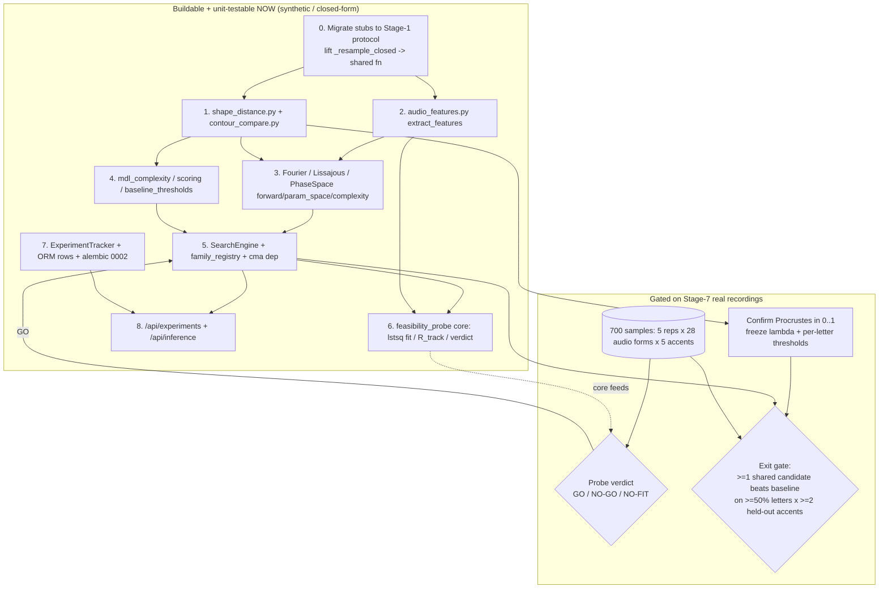

# Phase 2 Implementation Plan — Baseline Transform Search

**Project:** audio-glyph-inference · **Phase:** 2 (baseline `SearchEngine` + three `F_θ` families) · **Status target:** pre-alpha patch bumps under one unreleased `0.0.x` heading until the search runs end-to-end on real data.

**The one-line thesis you must hold throughout:** the unknown is the operator `F_θ`. A `F_θ` that *selects* a glyph from phoneme identity is the forbidden lookup-table. Continuity of `F_θ` in audio is **not** a defense against it — the only real defenses are (1) **structural capacity limits** on the audio→θ map, (2) **leave-one-accent-out generalization**, and (3) the **shared-vs-per-letter complexity penalty**. This plan bakes all three in and removes every "Lipschitz ⇒ not-a-lookup" claim from the dimension designs as invalid.

---

## 1. Phase-2 overview - what gets built, in dependency order

**Implementation status update:** Layers 0-8 approved-contract path are implemented and focused-verified to 100% coverage. Layer 7/8 intentionally mirror only the currently approved Pydantic contracts; the optional `status` column and candidate provenance FK remain a maintainer decision. Layer 6 core is done; only the real-data verdict run is gated on Stage-7 recordings. Next implementation target: Phase-2 real-data calibration / exit-gate execution once recordings are available, or the optional schema upgrade if the maintainer signs it off.

### Build sequence (each layer is fully unit-tested before the next builds on it)

| # | Layer | Modules | Buildable+testable NOW (synthetic/closed-form)? |
|---|-------|---------|---|
| 0 | **Stub migration** (atomic, single owner) | migrate `fourier_series.py`, `lissajous.py`, `phase_space_embedding.py` to the Stage-1 protocol; lift `_resample_closed` to a shared free function | YES |
| 1 | **Shape distances + reference tests** | `shape_distance.py` (3 fns), `contour_compare.py` (multi-stroke adapter) | YES — closed-form (rotated-square Procrustes=0, hand-built Chamfer, parallel-polyline Fréchet) |
| 2 | **Feature extraction** | `audio_features.py` (one pure free fn `extract_features`) | YES — closed-form (DC frame, pure tone, frame-permutation invariance, slot identity) |
| 3 | **Families** | the three migrated families' `forward`/`parameter_space`/`complexity` | YES — closed-form (sine→ellipse, delay-embed sine→ellipse axis ratio, exact-linearity Jacobian) |
| 4 | **Complexity/λ/scores + baseline calibrator** | `mdl_complexity.py`, `scoring.py` (simplicity/interpretability), `baseline_thresholds.py` | YES — closed-form on synthetic θ + synthetic targets |
| 5 | **SearchEngine** | `search_engine.py` + `family_registry.py` + `cma` dep | YES — closed-form θ-recovery on a synthetic shape-sensitive family; batched==scalar equivalence |
| 6 | **Feasibility-probe core** | `feasibility_probe.py` (pure: lstsq fit, R_track, verdict classifier) | YES core / **GATED** verdict run |
| 7 | **Tracker + ORM + Alembic 0002** | fill `experiment_tracker.py`, fill `*_row.py` stubs, `0002_experiment_tables.py` | YES (ORM via testcontainers Postgres) |
| 8 | **Endpoints** | `routers/experiments.py`, `routers/inference.py`, registry wiring, `dependencies.py` | YES (httpx + real Postgres + stub/real engine) |

**Implementation status (live tracker: `docs/status.md`):** Layers 0–8 are implemented and focused-verified to 100% on the approved-contract fallback path: shape distances, features, shared contour primitives, the three migrated families, scores + exit-gate calibrator, `SearchEngine`, feasibility-probe core, tracker/ORM/Alembic, and endpoints. `mdl_complexity.py` was folded away (per-family `complexity()` already covers §3 — see `status.md`). Layer 6's verdict and the exit-gate *run* await Stage-7 data (the gate aggregator is built). The optional Layer-7 `status` column and candidate provenance FK still await maintainer sign-off.

**Gated on Stage-7 real data (NOT a CI test — a manual kickoff step):**
- The **feasibility-probe GO/NO-GO verdict** (needs the 3-letter × ≥3-accent subset, §7).
- **Freezing λ, `C_scale`, and the per-letter exit thresholds** into `config_snapshot` after the Procrustes normalization is confirmed empirically to land in `[0,1]` on the 22 real targets (§6).
- The **Phase-2 exit gate** numeric pass/fail (§6, §9).

### Build/data flow



---

## 2. The audio→contour design — and why it is not a lookup table

### Pipeline

```
PreprocessResult.frames  (num_frames, 512) float64 in [-1,1]   ← already built (Phase 1)
   → extract_features(frames)           → φ ∈ R^D            (one pure free function)
   → coeffs = M·φ + b                    (affine map = the fitted θ, SHARED across letters)
   → synthesize contour from coeffs      (family-specific: trig poly / oscillator pair / placement)
   → centroid-center + 0.5/max-abs scale → (N, 2) in [-0.5, 0.5]
```

`extract_features` lives in **`backend/src/simulation/audio_features.py`** (one free fn; mirrors the documented single-file exception for closely-related numerics). Pure NumPy/SciPy — **never `librosa` inside the hot path** (heavy import, version-nondeterminism; `forward()` must be pure and called thousands of times).

**Feature vector φ ∈ R^D — deliberately SMALL and NOT a clean letter code (see anti-lookup below):**

| Block | Content | dims |
|---|---|---|
| log-mel mean over frames | `log(mel_fb @ |rfft(frame·hann)|² + eps)`, mean over frame axis | `n_mels` (default **8**) |
| spectral descriptors mean over frames | centroid, bandwidth, rolloff-85%, flatness | 4 |
| **temporal segmentation** | the same 4 descriptors computed over **3 equal time-thirds** (onset / mid / tail), retaining transient structure | 12 |

**D = n_mels + 4 + 12 = 24** at `n_mels=8`. Frequency bins derived from `audio_sample_rate_hz` and `frame_length`. Each component standardized by **fixed offline reference mean/scale** in config (never train-data-derived → no held-out-accent scale leakage). All vectorized over the frame axis (no Python loop).

> **Decision — fold standardization into the affine map, do NOT route μ/σ through `forward()`.** Since `coeffs = M·φ + b` is affine, `(φ−μ)/σ` composed with it is *still one affine map* `M' = M·diag(1/σ)`, `b' = b − M·(μ/σ)`. The least-squares fit (§5) solves for `M',b'` on raw φ directly. `forward()` therefore stays a pure function of `(audio, theta)` with zero external statistics — resolving the `audio-features` design's open question and the conformance critique's purity finding.

### Why this is NOT a lookup table (folding in the lookup-table critique, verdict: concerns → resolved)

The dimension designs claimed "affine ⇒ Lipschitz ⇒ structurally cannot be a lookup." **That argument is wrong and is removed from this plan.** A linear map over near-letter-separable features *is* a soft lookup; Lipschitz continuity bounds how fast the output moves, not the within-letter output variance. The real guards, all enforced here:

1. **Structural capacity cap (the primary guard).** The audio→coeff map is **low-rank** and **low-dimensional**, not a free `4K×D` matrix. Concretely: cap `D ≤ 24` (small, transient-retaining features — *not* the 48-dim maximally-accent-invariant features the original `audio-features` design proposed, which would collapse to a soft phoneme label) **and** constrain `M` to **rank `r ≤ 3`** (declared as an integer ParameterSpec; factored `M = U·Vᵀ`, `U∈R^{4K×r}`, `V∈R^{D×r}`). A rank-2/3 affine map provably cannot route 22 audio clusters to 22 independent glyph constants. Parameter count must satisfy `n_params(M,b) ≪ B_train (≈440)`: with `K=3, D=24, r=2`, params `= r(4K+D)+4K = 2·(12+24)+12 = 84 ≪ 440`. **Over-parameterization (which guarantees memorization) is made impossible by construction.**
2. **Ridge-regularized closed-form fit.** `M' = (ΦᵀΦ + αI)⁻¹ΦᵀC` with `α` in config — the linear analogue of the λ·Complexity term; further suppresses memorization.
3. **Leave-one-accent-out generalization.** A memorizing map fitted on 4 accents fails on the 5th (its φ falls outside the trained clusters). This is the headline eval, not a unit test.
4. **The lookup-ratio diagnostic `R = Var_within / Var_between`,** promoted from the probe to a **standing per-candidate field**, computed by the SearchEngine on **Procrustes-residual** contours (within-letter shape variance after similarity alignment / between-letter variance). `R → 0` with low train distance is the lookup signature → the candidate is flagged. The "continuity" reference tests that a constant-output lookup would *pass* are replaced by an **exact-linearity Jacobian test** (§3) and a **synthetic adversarial lookup test** (§3) that the diagnostic must *fire* on.

> **The tension we name explicitly (critique finding, high):** accent-invariance of φ and non-lookup-ness of `M` pull in opposite directions. The signal the project *needs* is sub-phonemic acoustic structure that varies continuously and maps to geometry — not the phoneme label. That is exactly why φ retains temporal/transient detail (the 12 segmented descriptors) rather than fully mean-pooling. **If the only φ that fits is the maximally-letter-separable one, that is the negative result** (master plan §37): no continuous audio→glyph operator beyond a lookup exists — and we report it rather than ship a disguised lookup.

---

## 3. Per-family specs

All three migrate to: `parameter_space() -> dict[str, ParameterSpec]`, `forward(audio, theta: Theta) -> np.ndarray (N,2) float64 in [-0.5,0.5]`, `complexity(theta) -> float`. `name()` unchanged. Synthesis output is centroid-centered + `0.5/max-abs` scaled (guard `max-abs` against zero with an eps floor → degenerate θ yields a collapsed contour scored as bad, never a crash). All three consume the **same** `extract_features` φ (single source of truth). `K` is **fixed in config** and NOT a searched ParameterSpec degenerate range (ParameterSpec forbids `high<=low`); families read `K` from `BackendSettings`.

### 3.1 Fourier — `fourier_series`

**Math.** `x(t)=Σ_{k=1..K} a_k cos(kt+φ_k)`, `y(t)=Σ_{k=1..K} b_k sin(kt+ψ_k)`, `t=linspace(0,2π,N,endpoint=False)`. Use the **real a/b/c/d full form** (or amplitude+phase — but use the real-linear coefficient form so the audio→coeff map is strictly affine and the linearity test is exact). The `4K` coefficients come from the rank-`r` affine map `coeffs = U·(Vᵀφ) + b`.

**θ keys / ParameterSpec.** Per the conformance critique, `M` is **closed-form-fit, not grid/CMA-searched** — so it is **not** declared as 84 scalar ParameterSpecs. Declared search domain (what the SearchEngine actually searches over):

| θ key | Theta type | ParameterSpec | role |
|---|---|---|---|
| `rank_r` | int | `integer(low=1, high=3)` | affine map rank (searched; caps capacity) |
| `ridge_alpha` | float | `continuous(low=1e-4, high=1.0)` | lstsq regularization (searched, log-spaced) |

Fitted (stored in θ as `list[float]`, produced by lstsq inside `fit`, **declared as compact list values per ThetaValue**, not per-element specs): `affine_u`, `affine_v`, `affine_b`. `K` from config. This resolves the vector-ParameterSpec gap decisively: **the high-dimensional map is never in the search domain; only the 2 capacity knobs are.**

**`complexity(theta)`** = `MDL(active params)` via shared `mdl_complexity`: `n_eff = rank_r·(4K + D) + 4K`, cost `= BITS_PER_PARAM·n_eff + ORDER_PENALTY·K + Σ log2(1+|coef|)`.

**Strengthened closed-form reference tests** (replacing the invalid continuity tests):
- **Exact ellipse (orientation-pinned, swap-proof):** with `K=1` and `M` set so `coeffs=(a_1,b_1,φ_1,ψ_1)=(A,B,0,0)`, assert the point at `t=0` is `(±0.5,0)` and at `t=π/2` is `(0, ±0.5·B/A)` (pins *both* coordinates at two parameter values; `atol=1e-9`). An x/y axis swap fails.
- **Exact linearity / anti-collapse:** the contour is linear in `coeffs` and `coeffs` linear in φ ⇒ a **constant Jacobian** `J = (basis matrix)·M`. Assert `forward(φ_b) − forward(φ_a) == J @ (φ_b − φ_a)` exactly (`atol=1e-9`) **and** `forward(φ_a) != forward(φ_b)` for `φ_a≠φ_b` (catches the constant-output lookup bug).
- **Closure + winding:** `contour[0]` is `t=0`; shoelace signed area ≠ 0 for nonzero coeffs.
- **Containment + non-degeneracy:** random valid θ → shape `(N,2)`, `float64`, all coords in `[-0.5,0.5]`, **and** `max|coord| ∈ [0.5−tol, 0.5]` (contour touches the box; kills all-zeros bug).

### 3.2 Lissajous — `lissajous`

**Math.** `x(t)=A_x sin(a·t+δ)`, `y(t)=A_y sin(b·t)`, `t∈[0,2π)`, integer `a,b`. The continuous shape drivers `(δ, A_x, A_y)` come from a small affine-of-φ (shared); `a,b` are **fixed global θ** (constant across all samples — they cannot encode 22 letters).

**θ keys / ParameterSpec.**

| θ key | Theta type | ParameterSpec |
|---|---|---|
| `freq_ratio_a` | int | `integer(low=1, high=5)` |
| `freq_ratio_b` | int | `integer(low=1, high=5)` |
| `affine_w` / `affine_b` | list[float] | fitted by lstsq (small: `3×D`); not searched per-element |

**`complexity`** = `nnz(affine) + log2(a) + log2(b)` (figure-eights cost more).

**Strengthened reference tests:**
- **Exact ellipse + degenerate line:** `a=b=1, δ=π/2, A_x=2A_y` → axis ratio test via the **t∈{0,π/2,π,3π/2} coordinate pairs** (swap-proof). `δ=0` → assert `y≈x` (collapsed line, `atol=1e-9`).
- **Figure-eight (1:2):** `a=1,b=2,δ=π/2` → self-intersects once at origin; symmetric under `x→−x`.
- **Pure-tone φ sanity:** synthetic single-tone frames → `extract_features` centroid ≈ `f₀/Nyquist` (`atol` = FFT bin width `16000/512≈31.25 Hz`), flatness ≈ 0.
- **`a,b` are global, not audio-driven:** same audio twice → identical contour; and asserting `forward` has no path that varies `a,b` with φ.

### 3.3 Phase-space — `phase_space_embedding`

**Math.** Reconstruct 1D `s` from frames by overlap-trim (first `hop` samples of each frame + last frame's tail; clamp `τ < L−2`), mean-remove + unit-variance, Takens 2D embed `P=stack([s[:-τ], s[τ:]],1)`, rigid map `Q=gain·R(rot)·(P−c)`, **arc-length resample to N** (reuse the lifted `_resample_closed`), `clip(Q, −0.5, 0.5)`. This family has **no learned feature→param map** — θ is pure rigid placement, so it genuinely cannot memorize. It is the least expressive and the most likely **honest negative result** (acceptable per master plan §6).

**θ keys / ParameterSpec.**

| θ key | ParameterSpec |
|---|---|
| `tau` | `integer(low=1, high=64)` |
| `gain` | `continuous(low=0.05, high=2.0)` |
| `rotation` | `continuous(low=-PI, high=PI)` |
| `center_x` | `continuous(low=-0.5, high=0.5)` |
| `center_y` | `continuous(low=-0.5, high=0.5)` |

**`complexity`** = `5 + log2(1+Ï„)`.

**Strengthened reference test (non-degenerate angle, tight tol):** for a sine `s[n]=sin(ωn)`, the delay embedding is an ellipse with axis-eigenvalue ratio `λ_ratio = (1−|cos ωτ|)/(1+|cos ωτ|)`. Assert at **`ωτ=π/3`** that the covariance eigenvalue ratio equals `tan²(π/6)` to `atol=1e-6` (not just the 0/1 endpoints). Plus: rotation correctness (principal eigenvector rotates by `R(rot)`), gain linearity, degenerate all-zero audio → N identical clamped-center points (no exception), determinism (bitwise-identical on repeat).

---

## 4. Shape distances + multi-contour reconciliation

### Default metric & normalization (LOCK at kickoff)

- **Default scoring metric = Procrustes** (full-Procrustes disparity `D = 1 − (Σ s_k)²` after Kabsch/Umeyama similarity alignment, **reflection disabled** — Hebrew letters are chiral). `D ∈ [0,1]`, scale/rotation/translation invariant. **This is the search-time fitness.**
- **Fréchet is a final-report tiebreaker only — never the search objective** (its DP is O(N·M)·shifts and dominates runtime).
- **Normalize Chamfer and Fréchet by the unit-square diagonal `√2`** (add `SQRT2` to `constants.py`) so all three live on a comparable `[0,1]`-ish scale and `λ` transfers across metrics. **Split every metric's reference test into a raw-value layer (closed-form, before normalization) + a separate convention layer (asserts the `/√2` divisor)** so a missing-normalization bug is caught distinctly from a convention choice.

### Fréchet start-point resolution (master plan §5 / decision #7)

`forward` contours and cv2 contours start at arbitrary vertices. **Resolution:** Fréchet (and the optional Procrustes correspondence) **minimize over `K` cyclic start-shifts of the generated contour × winding reversal, holding the target fixed as canonical.** `K = config.shape_distance_cyclic_shifts` (default 16) at search time; **`K = N` (exact) for the final leave-one-accent-out report.** Reference test asserts both: `K=N` ⇒ `frechet(C, roll(C,7))==0`; small `K` ⇒ `frechet(C, roll(C,N//2)) > 0` (proves the shift search is real, not a no-op).

### Multi-contour reconciliation (resolving the forward()-vs-list tension — DECISIVE)

The **conformance critique is correct**: `SearchEngine.fit` already types `targets: (B, num_points, 2)` — a *single, pre-flattened* contour per example. The ragged `list[np.ndarray]` exists only at `GlyphExtractor.extract`. **So there is no live tension inside the engine.** Decision:

- **Flatten upstream, once, in the `/api/experiments` executor** (the caller), before `fit`: concatenate each `GlyphTarget`'s ordered strokes (largest-first) into one `(num_points, 2)` array. The extractor already allocates `Σ n_i ≈ num_points`, so concatenation fits the budget.
- `forward()` keeps the **sacred single `(N,2)` return** — unchanged.
- **Scoring rule:** 20 single-stroke letters → Procrustes (default). For the **2 multi-stroke letters (ה, ק)**, Procrustes/Fréchet assume point correspondence the concatenation breaks → the engine **auto-substitutes Chamfer for those rows only (logged on the run)**. Config `search_multistroke_metric: Literal["chamfer","error"] = "chamfer"`.
- **Drop the ContourSet / Hungarian / `target_stroke_ids` machinery for Phase 2** (tractability + coverage critique): it has *no producer* (all Phase-2 families emit one stroke) and its unmatched-stroke-penalty cannot be calibrated without real multi-stroke output. Defer to Phase 3.
- A single shared helper `contour_compare(generated, target, metric)` (in `contour_compare.py`) is the only thing both the engine and `/api/inference` call, so they share identical comparison code.

`shape_distance.py` keeps the three primitive `(N,2)×(N,2)->float` signatures unchanged. Lift `_resample_closed` from `GlyphExtractor` into a shared free function (imported back by the extractor) to avoid duplication — covered by tests so the 100%-gated extractor coverage doesn't drop.

---

## 5. SearchEngine

### Objective & signatures

`J(θ) = (1/B)·Σ_i contour_compare(F_θ(x_i), L_i, metric) + λ·complexity(θ)·sharing_multiplier`. `mean_shape_distance` reported = data term only; `J` is the sort key. Constructor validates `strategy ∈ {grid, cma-es}` and `distance_metric ∈ {procrustes, frechet, chamfer}` (else `ValueError`); `bayesian`/`symbolic-regression` raise (Phase 3).

### Strategies & the tractability fix (critique: critical)

The affine map `M` (84–1568 params) is **intractable for grid/CMA-ES and would memorize**. **Decision — closed-form least-squares for the affine map; grid/CMA-ES only for the small knobs:**

| Family | Searched by grid/CMA-ES | Fitted by closed-form ridge lstsq |
|---|---|---|
| Fourier | `rank_r` (1–3), `ridge_alpha`, outer `K`∈{1..K_max} | `affine_u, affine_v, affine_b` |
| Lissajous | `freq_ratio_a, freq_ratio_b` | `affine_w, affine_b` |
| Phase-space | `tau, gain, rotation, center_x, center_y` (5 params) | — (no affine map) |

- **Closed-form fit:** `M' = (ΦᵀΦ + αI)⁻¹ΦᵀC` — `O(seconds)` on 440×24, runs once per `(K, rank_r, α)` combo. Requires `n_params ≪ B_train`, enforced by the capacity caps.
- **grid:** exhaustive Cartesian product of the small discrete/continuous knobs, capped at `max_evaluations` (`search_grid_truncation: Literal["error","seeded-shuffle"]="error"`). The only CMA-suitable family is phase-space (5 continuous-ish params) and the small-K outer loops; integer params handled as outer grid loops, not CMA coordinates (avoids plateaus).
- **cma-es:** **hard dependency `cma` (pycma, BSD-3, pure-Python — add to `pyproject.toml` dependencies + `docs/dependencies.md` + Dockerfile).** Normalized `[0,1]^D` genotype, `_decode` maps to bounds / choice indices, `seed` → `cma` option. Reserved for continuous-heavy phase-space; documented as such.

### ParameterSpec → search domain

One `_decode(genotype) -> Theta` is the single vector↔Theta converter shared by grid and CMA. `continuous→linspace`/live float; `integer→arange`/`round+clip`; `categorical→choices`/`floor+clip`. The fitted affine lists are packed into `theta` as `list[float]` *after* lstsq, before constructing the candidate (Option B from the conformance critique — keeps `theta` JSONB-compact).

### Batched scoring (resolving the conformance + tractability critiques)

- **No `_forward_batch` second code path.** `forward()` is the single source of truth, called per example (the dataset is ~440 examples, not millions). Variable `num_frames` means `audio` cannot be a rectangular `(B,num_frames,512)` array — **precompute `Φ = (B, D)` once at `fit` entry** (features pool over frames), then the affine+synthesis is a clean `(B,N,2)` einsum on `Φ`. Caller passes per-sample frame matrices (object array / list); a **signature note for synthesis**: `fit`'s `audio` is effectively a sequence of per-sample frame arrays, not a single 3D tensor (the docstring's `(B,num_frames,frame_length)` is honored as "B per-sample frame matrices").
- **Vectorize the DISTANCE (the genuine hot path across thousands of candidates):** Procrustes via batched `(B,2,2)` SVD (guard degenerate/coincident contours → large finite penalty, not NaN); Chamfer via batched `cKDTree` queries; Fréchet (tiebreaker only) via `@numba.njit` B-loop.
- **Mandatory reference test:** batched scorer `== ` per-example `forward()`+`contour_compare` loop (`assert_allclose atol=1e-10`) — locks the two paths together.

### shared-vs-per-letter

- **shared=True (preferred):** one θ over all examples; per-sample variation only from φ inside `forward`. The headline candidate.
- **shared=False:** 22 independent sub-fits (closed-form for affine families; documented **expected-to-overfit control**, not a solution). Penalized via `sharing_multiplier = 1 + per_letter_penalty·N_LETTERS` at the objective site (encapsulated in one tested method so the penalty can't silently vanish).
- **Hard rule (critique):** only `shared_across_letters=True` candidates are eligible for the headline leaderboard, "best candidate," and the **exit gate**. Per-letter results are reported separately as the lookup-ceiling reference and labeled as such (especially any with `R≈0`).

### Reference test (strengthened — critique: the IdentityScale test was scale-degenerate)

Procrustes is **scale-invariant**, so a `θ['s']·circle` recovery target has *no unique minimum*. **Fix:** recover a **shape** parameter — `EllipseFamily forward = [0.5·cos t, b·sin t]`, target `b*=0.3`; Procrustes *is* sensitive to axis ratio → unique minimum at `b=0.3`. Grid recovers `b≈0.3` to grid resolution; CMA recovers to `atol=1e-2` and is **bitwise-reproducible across two runs with the same seed**.

---

## 6. Decisions to LOCK at kickoff

All values land in `BackendSettings` (data-driven). Defaults below; **bold = needs maintainer sign-off before the gate is asserted.**

### Complexity(F_θ) — MDL, shared `mdl_complexity.py`

```
L(continuous) = log2(1 + (high-low)/q_cont)      # q_cont = complexity_precision_step (default 0.05)
L(integer)    = log2(1 + (high-low))
L(categorical)= log2(len(choices))
N_eff         = Σ active scalar params (rank-factored for affine families)
Complexity    = BITS_PER_PARAM·N_eff + struct_cost·(#keys) + Σ log2(1+|coef|) + ORDER_PENALTY·K
sharing_multiplier = 1.0 (shared) | 1 + per_letter_penalty·22 (per-letter)   # applied at objective site, NOT inside complexity()
```

### λ and the scores

| Knob | Default | Rationale / sign-off |
|---|---|---|
| `search_default_lambda` (λ) | **0.01** | shape term dominates (master plan §35); **calibrated to a [0,1] Procrustes scale — confirm scale empirically first** |
| `search_lambda_sweep` | `[0, 0.003, 0.01, 0.03, 0.1]` | run as separate `ExperimentRun`s, same seed |
| `lambda_accuracy_tolerance` | 0.05 | pick largest λ within tol of λ=0 best (Pareto knee) |
| `simplicity_score` | `1/(1 + Complexity/C_scale)`, `C_scale=50` | `=0.5` at `Complexity=50`; clamp `[0,1]` |
| `interpretability_score` | `simplicity_score · prior(family)` | priors `{lissajous:1.0, phase_space:0.9, fourier:0.8}` — **judgment calls, affect reporting only, never the objective or gate** |

### Procrustes baseline threshold (exit gate) — calibrated, not invented

```
unit_circle      = closed circle, num_points, inscribed so max|coord| == 0.5 (same normalization as targets)
d_circle(letter) = procrustes_distance(unit_circle, target(letter))     # non-trivial null (a shape, zero audio info)
d_const(letter)  = procrustes_distance(centroid_point_cloud, target)    # trivial null floor
exit_threshold(letter) = baseline_margin · d_circle(letter)             # baseline_margin = 0.6 (per-letter)
```

**Gate (master plan §191):** a run passes iff for **≥2 held-out accents**, `#{letters: best_shared_candidate_distance(letter) ≤ exit_threshold(letter)} ≥ ceil(0.5·22)`. Knobs: `exit_gate_baseline_margin=0.6`, `exit_gate_letter_fraction=0.5`, `exit_gate_min_accents=2`. Per-letter thresholds + the resolved scale are serialized into `ExperimentRun.config_snapshot` and the JSONL.

**Sign-off needed:** **λ=0.01, C_scale=50, baseline_margin=0.6** are all calibrated to an *assumed* Procrustes `[0,1]` range. Kickoff step: implement `shape_distance`, run circle/const baselines on the 22 real targets, confirm range, **then freeze**. The exit-gate *aggregator logic* is unit-testable now on a synthetic distance table.

---

## 7. The feasibility probe — existential-risk entry gate

A one-page GO/NO-GO **before** spending search compute. `backend/scripts/feasibility_probe.py` (driver) + pure core in `backend/src/simulation/feasibility_probe.py` (one class). Uses the formalized affine-Fourier family fit by **closed-form ridge lstsq** (no optimizer → removes "the search was too weak" as a confound).

### What it measures (the right quantity, per critique)

| Metric | Definition | Reads as |
|---|---|---|
| `R_track` | `Var_within / Var_between` on **Procrustes-residual** contours (within-letter shape variance after alignment / between-letter variance) | does audio *move* the shape? `R→0` = lookup |
| `Δ_lookup` | `D_const − D_probe` on the **held-out accent** | beats the per-letter-constant lookup on *unseen* audio? |
| `overfit_ratio` | `D_probe_out / D_probe_in` | did it memorize? |

### Pass/fail (critique fixes folded in)

- **GO (FEASIBLE):** **held-out only** — `D_probe_out < D_const_out` AND `R_track ≥ ρ_min` (on held-out) AND `overfit_ratio < overfit_ratio_max`. **Held-in fit quality is NOT a GO conjunct** (it overfits by construction); kept only as a `Δ_floor` sanity check.
- **NO-GO (TRIVIAL_LOOKUP):** good held-in fit but `R_track < ρ_min` OR `D_probe_out ≫ D_const_out`.
- **NO-FIT:** no better than the global mean even held-in.

`R_track` computed **pre the destructive renormalization** issue is avoided by measuring on **Procrustes-residual** (alignment removes scale/translation, isolating shape variance — the quantity the search actually optimizes). Ridge-regularize the lstsq so 84 params can't interpolate 24 points.

### Minimal Stage-7 data subset

- **3 single-contour, visually-maximal letters** (e.g. א, ם, ר — *verify each extracts to `num_contours==1` in this font first*; choosing single-contour dodges the multi-stroke tension at the gate — a scoped limitation, carried forward).
- **≥3 accents** (not 2 — for an existential gate, a 2-accent held-out split is merely directional; ≥3 gives a weak significance signal).
- **≥4 recordings per (letter, accent)** → ~36–48 samples.

**Adversarial reference test (must FIRE):** construct a synthetic "realistic lookup" `M` that routes the phoneme-discriminative φ dims to per-letter prototype contours; assert the probe classifies it `TRIVIAL_LOOKUP` (low held-out generalization despite good held-in fit). Plus the closed-form lstsq-recovery test (known `M` → exact recovery, `D_probe≈0`) and verdict-boundary parametrization.

---

## 8. Contract + scaffold migration

### Stub migration (single atomic owner — the Fourier/families work-item)

Migrate `fourier_series.py`, `lissajous.py`, `phase_space_embedding.py` from pre-Stage-1 signatures (`parameter_space()->dict[str,tuple]`, `forward(...,theta:dict[str,float])`, no `complexity`) to the current protocol. **No other work-item edits `transform_base.py`.** Add a **determinism test** (`forward` bitwise-identical on repeat; `np.array_equal`) to each — locks out hidden `default_rng()` entropy before search depends on seed reproducibility. Lift `GlyphExtractor._resample_closed` to a shared free function (re-imported by the extractor; covered by tests).

### ORM rows + Alembic 0002

**Fill the existing id-only stubs** `transform_candidate_row.py` / `experiment_run_row.py` (edit, do not create new files). Mirror the Pydantic models field-for-field; `theta`/`config_snapshot` → `postgresql.JSONB`; `created_at`/timestamps → `DateTime(timezone=True)`.

- **Contract additions (need sign-off, CLAUDE.md §8.7 — master plan §3.5/§3.6 update + maintainer OK):** `TransformCandidateRow.experiment_run_id` (provenance FK → `experiment_runs.id`) and `ExperimentRunRow.status` (`running`/`completed`/`failed`, forward-compat for async). `best_candidate_id` **already exists** on the Pydantic model — no new column; kept a plain `Uuid` (app-validated, not an FK, to avoid a mutual FK cycle). If rejected: drop both (recover provenance from JSONL, treat `completed_at != NULL` as completed).
- **`0002_experiment_tables.py`**, `down_revision="0001_baseline"`: create `experiment_runs` then `transform_candidates` (FK order); `downgrade` drops in reverse. **Reference test:** reflect the migrated schema and assert column set == ORM `mapped_column` set (catches `create_all`-vs-migration drift, since conftest uses `create_all`).

### ExperimentTracker

Fill the existing class (keep signatures exactly: `__init__(runs_dir)`, `log_run`, `log_candidate(run_id, candidate)`). One JSONL file per run (`{run_id}.jsonl`), `model_dump(mode="json")` for UUID/datetime safety. Additive `read_run() -> tuple[ExperimentRun, list[TransformCandidate]]` for Phase-5 replay. Postgres is the queryable index; JSONL is the reproducibility ledger.

### Endpoints

- `family_registry.py`: `FAMILY_REGISTRY: dict[str, type]` + `build_family(name, settings)` (families stateless except type; config from `BackendSettings`). The seam endpoints + executor use — no hard-coded family strings.
- `POST /api/experiments`: validate → create run `status="running"` (persisted *before* `fit`) → flatten targets upstream (§4) → `await anyio.to_thread.run_sync(engine.fit, ...)` → persist candidates (tracker + ORM) → `best_candidate_id`, `completed_at`, `status="completed"`; on error `status="failed"` + 500. Sync-now, background-ready (swap inline call for a worker later; schema/response unchanged).
- `GET /api/experiments` (filter `family`/`strategy`/`held_out_accent`/`status`, `started_at desc`, limit/offset), `GET /{id}` → `ExperimentDetail{run, best_candidate, candidate_count}`.
- `POST /api/inference`: load `AudioSample` + paired `GlyphTarget` + `TransformCandidate` → preprocess → `build_family(...).forward(frames, theta)` → `contour_compare` vs flattened target → `InferenceResult{shape_distance, contours: (N,2) as list[list[float]], target_contours}`. **`contours` is a single `(N,2)`, not a list** (conformance critique — `forward` returns one contour). Read-only; persists nothing. **Wiring test:** two different `audio_sample_id`s + same candidate → different `shape_distance` (proves audio flows in).

### Discipline

100% coverage gate (`--cov-fail-under=100`). The `status="failed"` branch and multi-stroke Chamfer-substitution branch need explicit tests or CI blocks build. `pragma: no cover` only on `if __name__=="__main__":` / genuinely untestable platform branches. Every metric/family has ≥1 closed-form reference test (no tautologies). `config_snapshot` builder must coerce `Path` fields via `model_dump(mode="json")` (else JSONB insert fails).

---

## 9. Risks & open questions

### Residual risks

| Risk | Severity | Mitigation in this plan |
|---|---|---|
| **Soft lookup table (the existential risk)** | critical | Structural caps (`D≤24` transient-retaining features, **rank `r≤3`**, `n_params≪B_train`), ridge fit, leave-one-accent-out eval, standing per-candidate `R = Var_within/Var_between` flag, adversarial probe test. Continuity is NOT treated as a defense. |
| Accent-invariance ⇄ non-lookup tension | high | φ retains sub-phonemic/temporal detail (12 segmented descriptors). If only the maximally-separable φ fits → **report as the negative result**, do not ship a disguised lookup. |
| Procrustes scale not yet pinned → λ/C_scale/threshold off by a factor | high | All config-driven; **freeze only after empirical scale confirmation** at kickoff. λ-sweep + per-letter circle calibration are self-correcting. |
| Fréchet runtime if used as fitness | medium | Procrustes is the search fitness; Fréchet is a final-report tiebreaker only; small `K` shifts at search time, exact `K=N` only for the final eval. |
| Over-regularization degenerates to the unit circle | medium | Exit gate *requires beating the circle by `baseline_margin`*; λ-knee selector caps λ at the accuracy frontier. |
| Variable `num_frames` breaks rectangular batching | medium | Precompute `Φ=(B,D)` (pool over frames) at `fit` entry; `audio` is a sequence of per-sample frame matrices. |
| `create_all`-vs-migration schema drift | medium | Reflection-equality reference test on 0002. |
| Multi-stroke (ה/ק) scored by concatenated Chamfer blurs the inter-stroke gap | low | Accepted, logged; ContourSet/Hungarian deferred to Phase 3 (no Phase-2 producer). |

### Open questions for the maintainer

1. **Sign off the calibrated numerics** (λ=0.01, C_scale=50, baseline_margin=0.6) *after* the kickoff scale-confirmation run — or supply preferred values.
2. **Sign off the two ORM contract additions** (`experiment_run_id` FK, `status` column) + master-plan §3.5/§3.6 update; else use the JSONL/`completed_at` fallback.
3. **Per-letter sharing penalty: linear (×22) or sub-linear (×log2 22)?** Linear is the strongest §2 statement but may bury per-letter diagnostics. Plan defaults linear.
4. **Probe letter set** — confirm א/ם/ר each extract to `num_contours==1` in `StamAshkenazCLM.ttf`; swap if not.
5. **`ρ_min` (R_track threshold)** is uncalibrated — set on the first real recordings before locking the probe verdict.
6. **Feature design**: confirm `n_mels=8` + 3 temporal thirds (transient-retaining) over the original 48-dim maximally-pooled design — this is the deliberate anti-lookup trade (some accent-invariance sacrificed for non-separability).

---

**Files touched (all paths absolute):** new — `backend/src/simulation/audio_features.py`, `contour_compare.py`, `transforms/mdl_complexity.py`, `scoring.py`, `baseline_thresholds.py`, `transforms/family_registry.py`, `feasibility_probe.py`, `backend/scripts/feasibility_probe.py`, `backend/src/models/{experiment_create,experiment_detail,inference_request,inference_result}.py`, `backend/src/api/routers/{experiments,inference}.py`, `backend/migrations/versions/0002_experiment_tables.py`; filled stubs — `backend/src/simulation/transforms/{fourier_series,lissajous,phase_space_embedding}.py`, `shape_distance.py`, `search_engine.py`, `experiment_tracker.py`, `backend/src/data/orm/{transform_candidate_row,experiment_run_row}.py`; edited — `backend/src/config.py` (search/scoring/feature/probe knobs), `backend/src/constants.py` (`SQRT2`), `backend/src/simulation/glyph_extractor.py` (re-import lifted `_resample_closed`), `backend/src/api/dependencies.py` + `main.py` (router/tracker wiring), `backend/pyproject.toml` + `backend/Dockerfile` + `docs/dependencies.md` (`cma` dep). Docs: `docs/status.md`, `docs/versions.md` (one `0.0.x` patch heading), `docs/phases/phase-2-plan.md`, master-plan §3.5/§3.6 (only if ORM additions approved).
